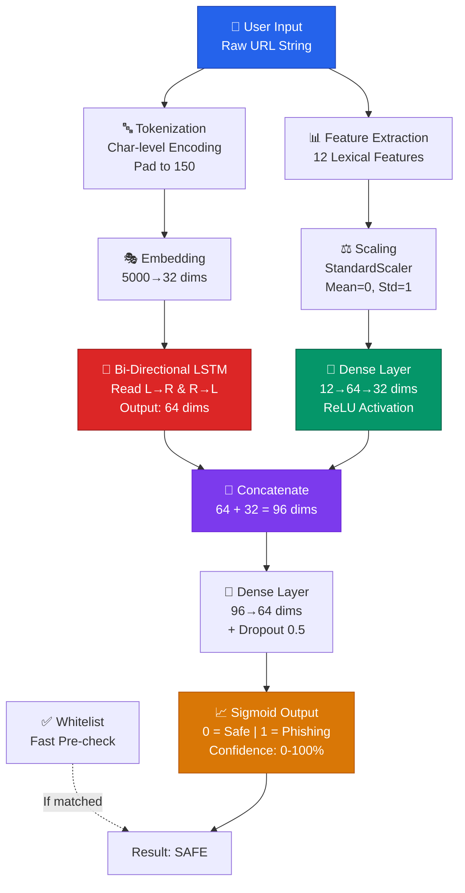
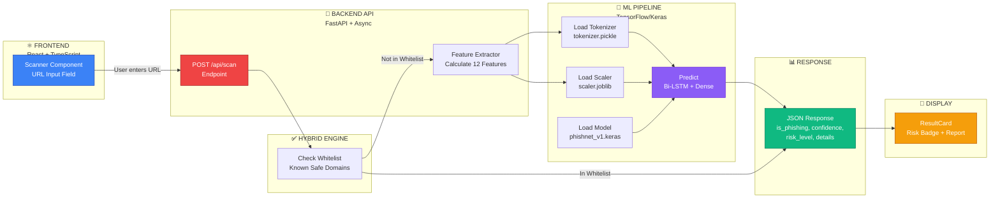
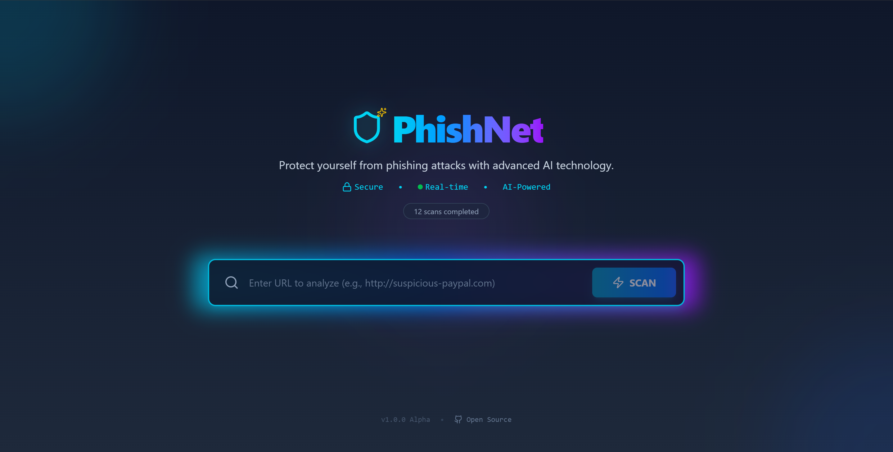
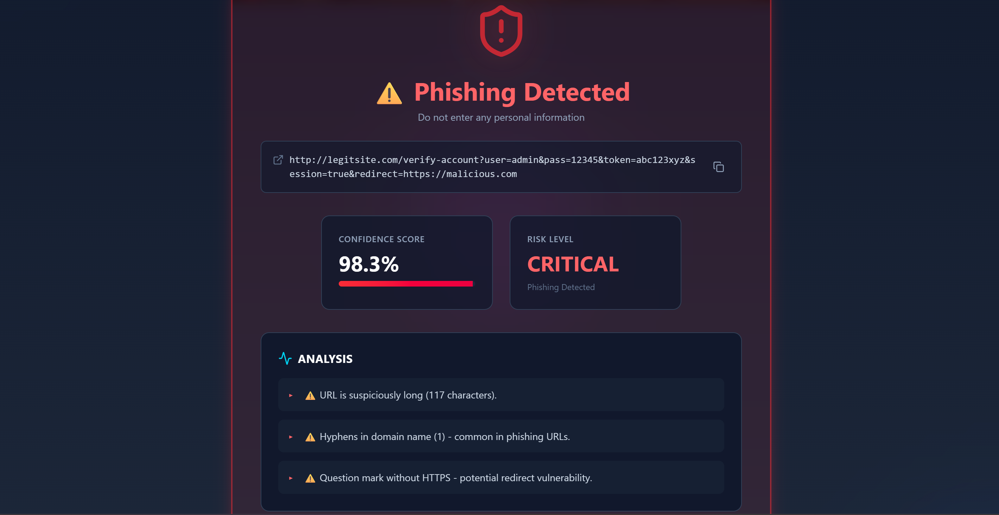
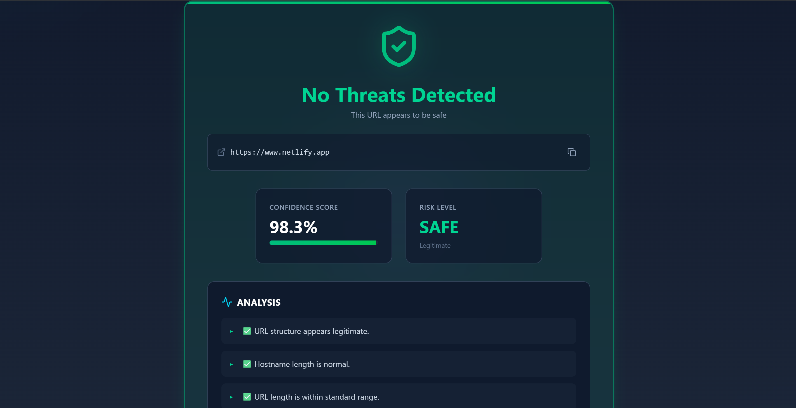

# 🛡️ PhishNet

**Advanced Hybrid Phishing Detection System (Rule-Based + Deep Learning)**

PhishNet is a full-stack cybersecurity tool that detects phishing URLs in real-time. It utilizes a **Hybrid Architecture** combining a high-speed whitelist engine with a custom **Deep Learning Y-Network** (Bi-LSTM + Dense layers) to analyze URL patterns and protect users from malicious attacks.

---

## 🎬 **Live Demo**


> *Scanning a phishing URL and getting real-time analysis with confidence score*

---

## ✨ Features

- 🧠 **Hybrid Detection Engine** - Instantly validates trusted domains (Whitelist) before engaging AI.
- 🤖 **Deep Learning Model** - Custom "Y-Network" architecture (Bi-LSTM for text + Dense for metadata).
- ⚡ **Real-time Analysis** - Millisecond-latency scanning.
- 🎨 **Cyberpunk UI** - Modern interface built with React, TypeScript, and Tailwind CSS v4.
- 📝 **Explainable AI (XAI)** - Generates a "Detailed Analysis Report" explaining *why* a URL was flagged (e.g., "Too many dots", "IP address usage").
- 🔒 **Secure Sandbox** - Analyzes URL strings lexically without visiting or executing the malicious site.

## 🎯 Why PhishNet?

| Feature | PhishNet | Traditional Tools |
|---------|----------|---|
| **Real-time Detection** | ✅ Instant | ✅ Instant |
| **Explainable Results** | ✅ Yes (3-5 reasons) | ❌ Black box |
| **Hybrid Approach** | ✅ Whitelist + AI | ❌ AI only |
| **No API Dependencies** | ✅ Self-contained | ❌ Requires internet |
| **Fast Processing** | ✅ <10ms per URL | ⚠️ Varies |
| **Privacy-Focused** | ✅ Local processing | ❌ Sends URLs to servers |

## 🏗️ Tech Stack

### Backend
- **Python 3.10+**
- **FastAPI** - High-performance Async API
- **TensorFlow/Keras** - Deep Learning Framework
- **Scikit-learn** - Feature Scaling & Preprocessing
- **Joblib/Pickle** - Artifact serialization

### Frontend
- **React 18** (TypeScript)
- **Vite** - Next-gen frontend tooling
- **Tailwind CSS v4** - Utility-first styling engine
- **Lucide React** - Modern iconography
- **Axios** - Promise-based HTTP client

## 📦 Project Structure

```bash
PhishNet/
├── backend/
│   ├── app/
│   │   ├── main.py             # Server entry point
│   │   ├── api/endpoints.py    # /scan route
│   │   └── services/
│   │       ├── feature_extractor.py  # Calculates 12 lexical features
│   │       └── predictor.py          # Hybrid (Whitelist + AI) logic
│   ├── models/                 # Saved .keras model
│   ├── data/
│   │   └── processed/          # Saved Tokenizer & Scaler
│   └── training/               # Jupyter Notebooks for training
│
└── frontend/
    ├── src/
    │   ├── components/         # Scanner & ResultCard components
    │   └── types.ts            # TypeScript interfaces
    └── vite.config.ts

```

## 🚀 Getting Started

### Prerequisites

* Python 3.8+
* Node.js 18+
* (Optional) Docker & Docker Compose for containerized deployment

### 🐳 Option A: Run with Docker Compose (Recommended for Production)

Docker containerizes both the backend and frontend for easy, reproducible deployment.

**Prerequisites:**
* Docker Desktop (includes Docker Compose)

**Steps:**

1. From the project root directory:
```bash
docker compose up --build
```

2. Access the application:
   - **Frontend:** `http://localhost` (port 80)
   - **Backend API:** `http://localhost:8000/api/scan` (port 8000)

3. To stop:
```bash
docker compose down
```

**What's Included:**
- `compose.yaml` - Orchestrates both services
- `backend/Dockerfile` - Python 3.10-slim with FastAPI
- `frontend/Dockerfile` - Node.js build → Nginx serving
- `.dockerignore` files - Optimize build context & image size

**Cleanup (reclaim disk space):**
```bash
docker compose down
docker system prune -a --volumes
```

---

### 1. Backend Setup (Local Development)

Navigate to the backend directory and set up the Python environment:

```bash
cd backend

# Create virtual environment
python -m venv .venv

# Activate it
# Windows:
.venv\Scripts\activate
# Mac/Linux:
source .venv/bin/activate

# Install dependencies
pip install tensorflow pandas numpy scikit-learn matplotlib seaborn fastapi "uvicorn[standard]" python-multipart joblib

# (Optional) Freeze dependencies for future use
pip freeze > requirements.txt

```

Start the Server:

```bash
uvicorn app.main:app --reload

```

*Server is running at: `http://127.0.0.1:8000*`

### 2. Frontend Setup (Local Development)

Open a new terminal and navigate to the frontend directory:

```bash
cd frontend

# Install dependencies
npm install

# Start the Development Server
npm run dev

```

*Client is running at: `http://localhost:5173*`

## 🎯 Usage

1. Open the application in your browser (`http://localhost:5173`).
2. Enter a URL to analyze (e.g., `http://secure-login-paypal-update.com`).
3. Click **SCAN**.
4. View the results:
* **Risk Level:** (Safe, Moderate, Critical)
* **Confidence Score:** AI certainty percentage.
* **Analysis Report:** Specific reasons for the flag.

---

## 🔬 Model Architecture & Deep Learning Pipeline

### Architecture Overview

The AI model utilizes a **Multi-Input "Y-Network" Architecture**:

1. **Branch 1 (Text Sequence):** Character-level Embedding → Bi-Directional LSTM (Learns semantic patterns in the URL string).
2. **Branch 2 (Metadata):** Dense Layers processing 12 calculated features (Length, IP presence, Dot count, Hyphen count, etc.).
3. **Fusion:** Both branches are concatenated and passed through a final Dense layer with Sigmoid activation.

### 📐 Y-Network Architecture Diagram



---

### 🔀 System Flow Diagram

How data flows from the user's input to the final security verdict:



---

### 📊 Dataset & Performance
- **Training Split:** 80% train, 20% test (with stratification)
- **Model Optimization:** Adam optimizer with binary crossentropy loss
- **Early Stopping:** Patience of 3 epochs to prevent overfitting
- **Batch Size:** 32 samples per batch
- **Max Epochs:** 20 (stopped early if no improvement)

### 🔍 Feature Extraction (12 Lexical Features)

The model analyzes these URL characteristics:

| # | Feature | Description | Why It Matters |
|---|---------|-------------|---|
| 1 | `length_url` | Total URL length | Phishing URLs are often longer than legitimate ones |
| 2 | `length_hostname` | Hostname (domain) length | Suspicious domains tend to be longer |
| 3 | `ip` | Uses IP address (0/1) | Indicates direct IP instead of domain name |
| 4 | `nb_dots` | Number of dots | Many dots = suspicious subdomains |
| 5 | `nb_hyphens` | Number of hyphens | Hyphens common in typosquatting attacks |
| 6 | `nb_at` | "@" symbol count | Used to obscure destination domain |
| 7 | `nb_qm` | "?" question marks | Indicates query parameters |
| 8 | `nb_and` | "&" ampersand count | Multiple parameters (obfuscation) |
| 9 | `nb_eq` | "=" equals count | Parameter assignment patterns |
| 10 | `nb_slash` | "/" forward slashes | Path depth indicators |
| 11 | `nb_colon` | ":" colons | Protocol/port indicators |
| 12 | `ratio_digits_url` | Digit to length ratio | Random number padding |

### 🎯 Risk Level Classification

The model outputs a confidence score (0.0 to 1.0) that maps to risk levels:

| Risk Level | Confidence Range | Action |
|------------|------------------|--------|
| **SAFE** | 0% - 50% | ✅ Low risk, safe to visit |
| **MODERATE** | 50% - 80% | ⚠️ Suspicious, proceed with caution |
| **CRITICAL** | 80% - 100% | 🚨 High phishing probability, avoid |

---

## 🧪 API Endpoints

### POST `/api/scan`

Analyzes a URL for phishing indicators.

**Request Body:**

```json
{
  "url": "http://example-phish.com"
}
```

**Response:**

```json
{
  "url": "http://example-phish.com",
  "is_phishing": true,
  "confidence_score": 0.98,
  "risk_level": "CRITICAL",
  "details": [
    "⚠️ URL is suspiciously long",
    "⚠️ Excessive number of dots detected",
    "⚠️ Deep Learning pattern match"
  ]
}
```

---

How data flows from the user's input to the final security verdict:


---

## �🖼️ User Interface Screenshots

### Home Page - URL Scanner


### Phishing Detected - Critical Risk


### Legitimate URL - Safe


---

## � Browser Extension (Coming Soon)

PhishNet is also available as a **Chrome/Firefox browser extension** for real-time URL scanning while browsing. 

*Status: In Development*

The extension will allow you to:
- Right-click on any link and check if it's phishing
- Display real-time security badges on search results
- Show confidence scores without leaving your browser

---

## 🎓 Training & Retraining

Want to retrain the model with your own dataset? Here's how:

### Prerequisites
```bash
cd backend
pip install jupyter
```

### Steps

1. **Prepare Your Dataset**
   - Format: CSV with columns `url` and `status` (where status = "phishing" or "legitimate")
   - Place it in `backend/data/raw/phishing.csv`
   - Minimum recommended: 5,000+ URLs (balanced classes)

2. **Run the Training Notebook**
   ```bash
   cd backend/training/notebooks
   jupyter notebook 01_eda_and_training.ipynb
   ```

3. **Execute All Cells** (Shift + Enter)
   - Cell 1: Load and explore data
   - Cell 2: Clean and split
   - Cell 3: Preprocessing (generates tokenizer + scaler)
   - Cell 4: Build Y-Network architecture
   - Cell 5: Train the model

4. **New Artifacts Generated**
   - `backend/models/phishnet_v1.keras` - Updated model weights
   - `backend/data/processed/tokenizer.pickle` - Fitted tokenizer
   - `backend/data/processed/scaler.joblib` - Fitted scaler

### Evaluation & Testing

After training, the notebook outputs validation metrics. To test on new URLs:

```python
from app.services.predictor import PhishNetPredictor

predictor = PhishNetPredictor()
result = predictor.predict("https://suspicious-url.com")
print(result)
```

**Output:**
```json
{
  "url": "https://suspicious-url.com",
  "is_phishing": True,
  "confidence_score": 0.87,
  "risk_level": "CRITICAL",
  "details": ["⚠️ Excessive number of dots...", "⚠️ Hyphens in domain..."]
}
```

---

## 🤝 Contributing

Contributions are welcome!

1. Fork the Project
2. Create your Feature Branch (`git checkout -b feature/AmazingFeature`)
3. Commit your Changes (`git commit -m 'Add some AmazingFeature'`)
4. Push to the Branch (`git push origin feature/AmazingFeature`)
5. Open a Pull Request

## 📝 License
Distributed under the MIT License.